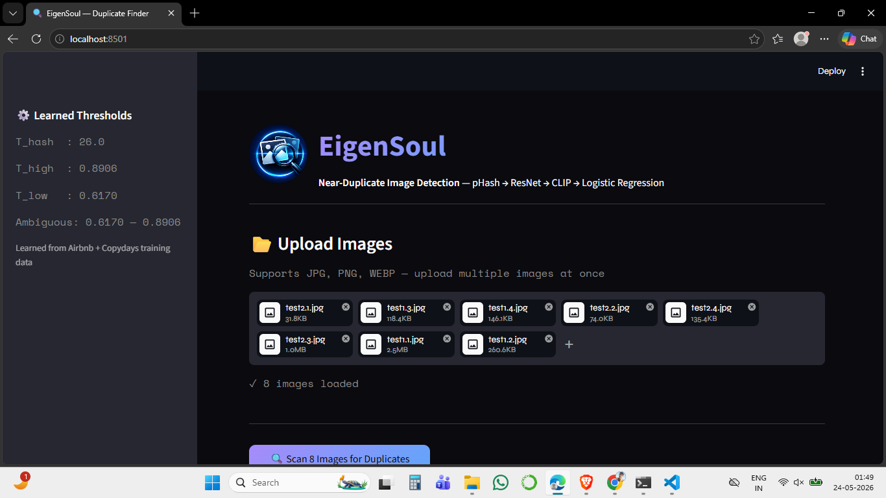
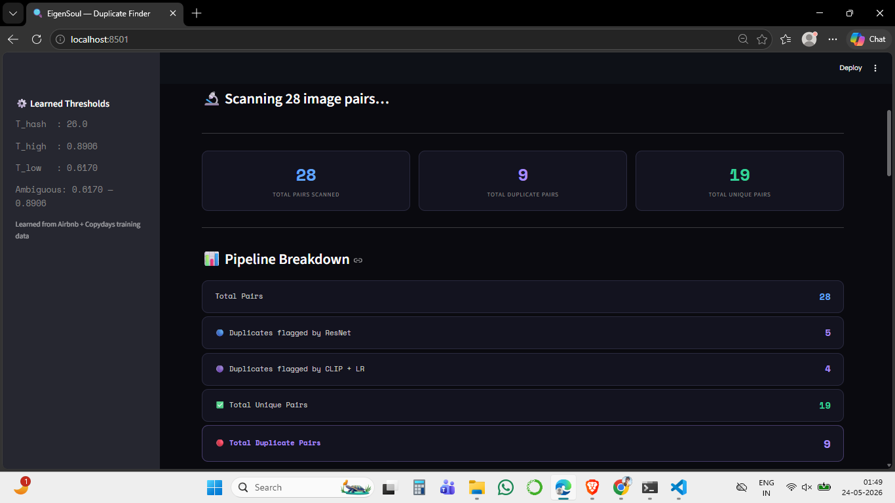
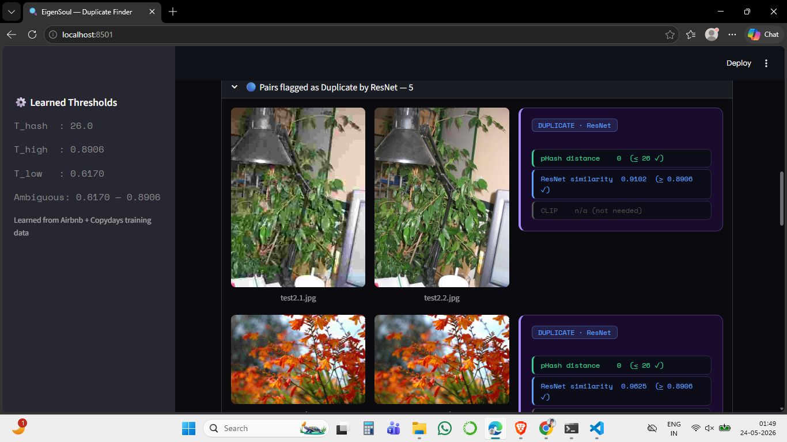
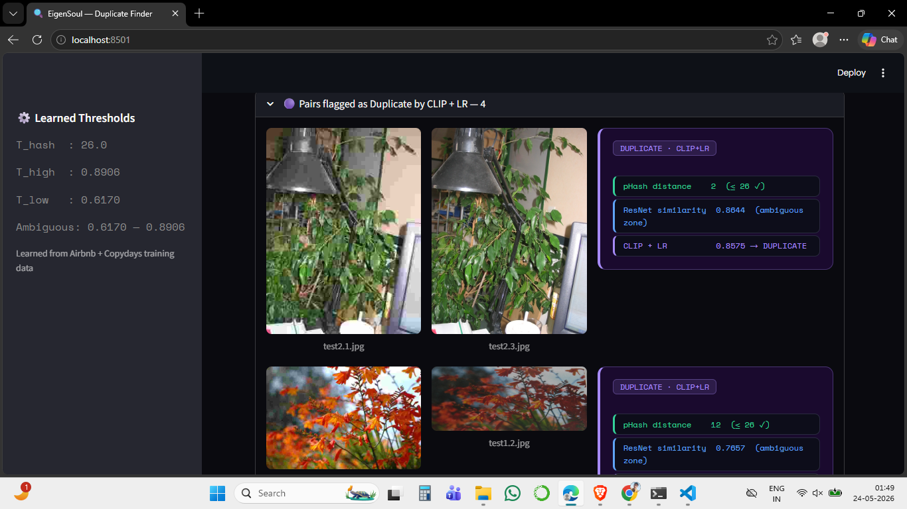

## EigenSoul - Cutting Through the Illusion of Duplicate Images :- 

Modern digital platforms are flooded with images that look different but share the same soul — the same source image, modified through cropping, resizing, compression, color changes, or print–scan artifacts.

This is a production-aware system for **Near-Duplicate Image Detection (NDID)** that cuts through these illusions and reliably identifies the original image.

**Importance :-** 

Storage Optimization → eliminate redundant copies

Spam \& Integrity → prevent repost bots, protect creators

Search Relevance → avoid showing the same image repeatedly

### 📊 Results :-

**Home — Upload Interface**

**Pipeline-Breakdown**

**Duplicates flagged by ResNet**

**Duplicates flagged by CLIP + LR**

### 📈 System Architecture :-

### 🏆 Approach :- 

We approached Near-Duplicate Image Detection as a multi-stage decision problem rather than a single embedding comparison. Given a query image, the system first applies perceptual hashing **(pHash)** as a fast structural pre-filter to eliminate obvious non-matches while retaining aggressively edited duplicates. The surviving candidates are then embedded using a **ResNet-based image encoder**, capturing robust structural and semantic cues and enabling efficient similarity-based retrieval. For cases where ResNet similarity alone is inconclusive, a **gated CLIP image encoder** is selectively invoked to provide high-level semantic alignment, avoiding unnecessary computation on confident cases. Finally, instead of relying on brittle hand-tuned thresholds, We employs a learned decision **calibration layer** that combines pHash distance, ResNet similarity, and CLIP similarity to make the final duplicate/non-duplicate decision. This staged design cleanly separates retrieval from decision-making, ensuring scalability, explainability, and high accuracy under real-world transformations such as cropping, resizing and compression.

##### Key Components :- 

**1️⃣ pHash -- Fast Structural Filter**

Removes obvious non-matches cheaply

Acts as a candidate generator, not a decision rule

Wide radius to survive strong transformations

**2️⃣ ResNet-50 -- Structural \& Semantic Retrieval**

Frozen ImageNet-trained backbone

L2-normalized embeddings

Retrieves top-K candidates efficiently

**3️⃣ CLIP -- Gated Fallback**

Activated only for ambiguous cases

Improves recall without sacrificing precision

Never used blindly on all images

**4️⃣ Learned Decision Calibration (The Breakthrough)**

Instead of brittle thresholds , we combined signals:

Tiny logistic regression

Fully interpretable

No vision model training

Dataset-specific calibration

### 🔗 Dataset :- 

**INRIA Copydays** - Near-duplicate benchmark with JPEG, crop and strong attacks 
(https://thoth.inrialpes.fr/~jegou/data.php.html#copyd)

**AirBNB** - Kaggle DataSet having images with duplicate pairs
(https://www.kaggle.com/datasets/barelydedicated/airbnb-duplicate-image-detection)

